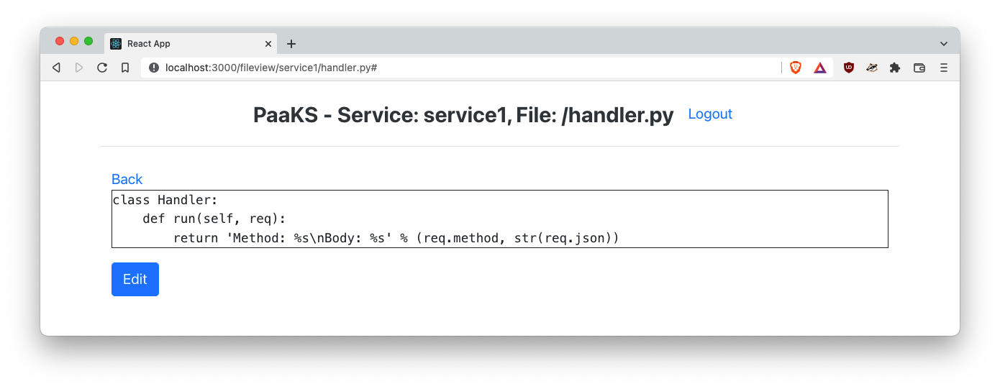

# PaaKS (Platform-as-a-Kubernetes-Service)

PaaKS is an open-source PaaS (Platform-as-a-Service) based on Kubernetes written in Go which allows to write Python apps.

## Requirements

- Docker
- Kubernetes
- Golang
- Python

## Overview

PaaKS is a Platform-as-a-Service deployable on Kubernetes. It right now provides the following features:

- The ability to deploy and execute Tenant Services written in Python
- Multi-tenancy (albeit with no security right now)
- A Web frontend allowing to see said running services, see and edit files available to those services, including the Python code executed

Future features:

- Ability to create a new Account Service from the frontend
- Authentication
- Database support
- Git integration

## Installation

- Modify `k8s-storage.yaml` so that the `path` variable points to the current `storage` folder
- Run `deploy_storage.sh` to create the file storage
- In the following folders run `build.sh` then `deploy.sh`: `frontend`, `dispatcher`, `filesystem`, `svc-mgr`, `svc-python`

## Services

The architecture contains the following services:

- `frontend`: a ReactJS project (accessible on port 3000) used by KAOS users
- `dispatcher` (accessible on port 8080): the endpoint to access micro-services deployed on KAOS
- `filesystem` (internal): allows to read and update files belonging to a given services
- `svg-mgr` (internal): the Service Manager which is used to list existing Services
- `tnt-<company ID>-*` (internal): any Tenant Service, i.e. a service created by a tenant

## Tenant Services (TS)

Tenant Services are micro-serviced tied to particular tenant. These are Python micro-services using the Flask framework.

In order to create a new service `newService` for account `12345678-1234-1234-abcdefghijkl`:

- Create a `tnt-12345678-newService` directory inside the `storage` directory
- Copy `storage/tnt-504f0000-service1/handler.py` to `storage/tnt-12345678-newService/`
- Make a copy of `k8s-tnt-504f0000-service1.yaml`
- Modify that copy to replace all mentions of `tnt-504f0000-service1` to `tnt-12345678-newService`
- Deploy that YAML file to Kubernetes by running `kubectl apply -f k8s-tnt-12345678-newService.yaml`

(these steps will be automated in the future)

From here, go to the frontend to look at the newly deployed service. Edit `handler.py` to change the business logic

## The UI

The UI is accessible on `http://localhost:3000` and right now allows to see the deployed account services, see and edit their files. When prompted for a login, enter the company ID (e.g. `504f0000-c95b-437a-a1da-4876c55e8e88`)

## The API

It is possible to access these micro-services through an API: `http://localhost:8080/[service]/. Those accept multiple types of methods (GET, POST)
